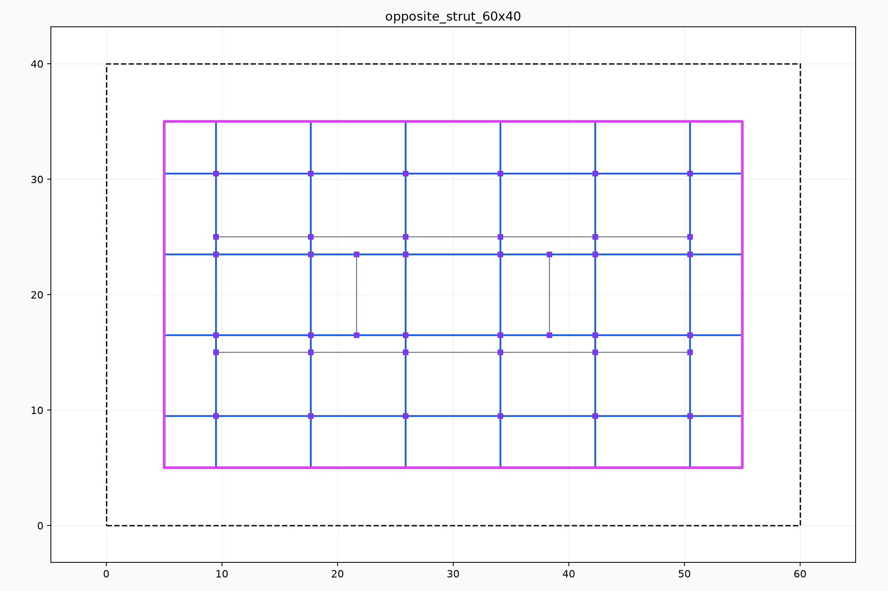
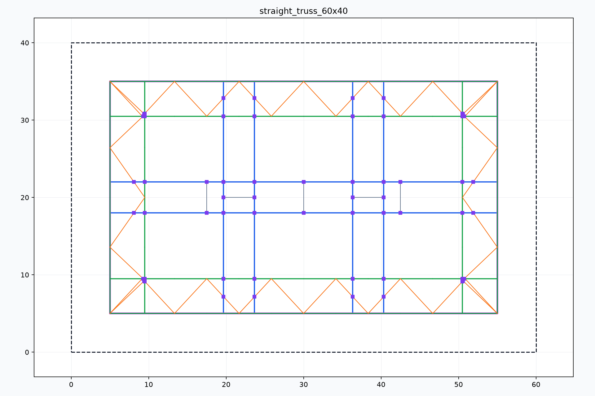
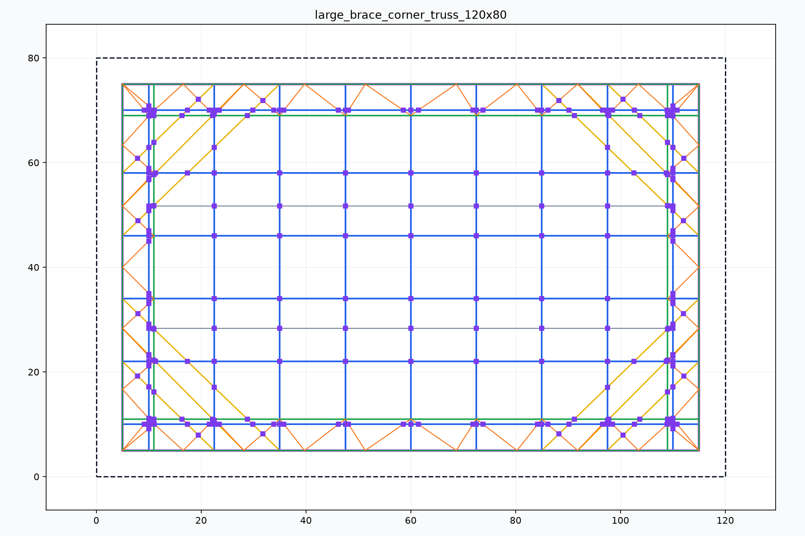
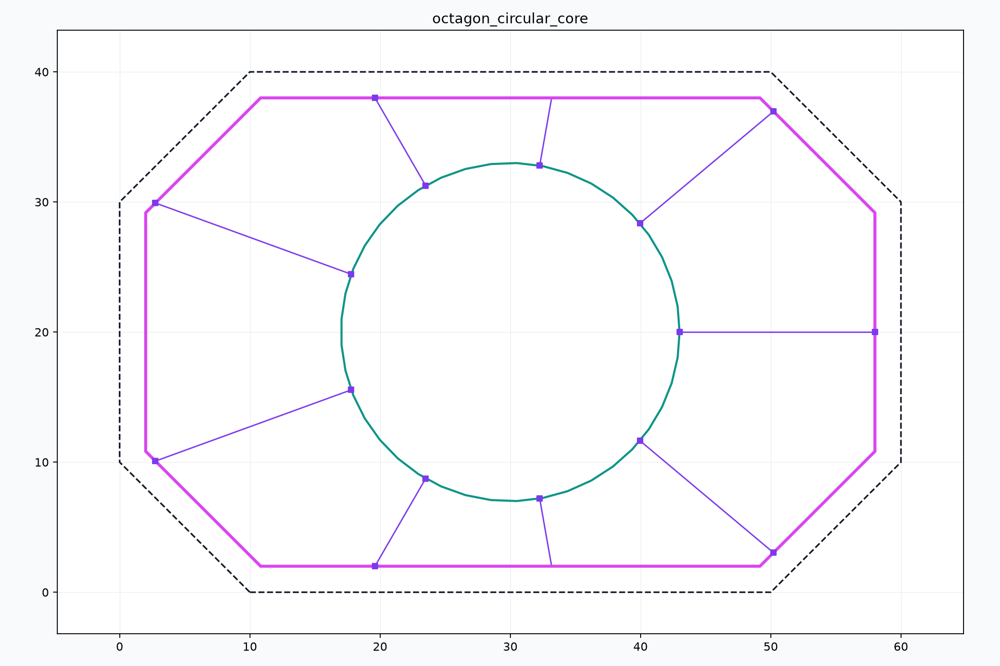

# Foundation Pit Support Layout Engine

Foundation Pit Support Layout Engine is a Python geometry engine for generating
internal support layouts for foundation pit excavations. It converts a 2D pit
boundary and an engineering parameter set into waling beams, main struts, ties,
truss chords/webs, corner braces, circular ring/radial supports, pillar
candidates, DXF output, and diagnostic PNG previews.

中文简介：这是一个面向基坑内支撑布置的 CAD 自动化引擎。它不是通用几何演示，而是为岩土/结构工程审图流程生成可检查、可导出、可迭代的支撑体系草图。

## Preview

| Opposite strut system | Straight truss system |
| --- | --- |
|  |  |

| Corner truss reinforcement | Circular core support |
| --- | --- |
|  |  |

These images are generated by `run_engineering_strut_checks.py` and are kept in
the repository as representative visual regression artifacts.

## What It Does

- Generates perimeter waling inside a pit boundary.
- Supports orthogonal struts, corner braces, straight truss systems, and
  circular core support systems.
- Builds a graph-style node/member model alongside legacy output buckets.
- Produces DXF files with support members on typed CAD layers.
- Exports diagnostic PNG previews for engineering review.
- Runs pytest checks and representative engineering plausibility checks.

## Intended Use

Use this project when you need a programmable first-pass support layout for
foundation pit review, CAD export, or geometry regression testing. The generated
layout should still be reviewed by qualified engineers before use in design or
construction documents.

## Repository Structure

| Path | Purpose |
| --- | --- |
| `strut_engine.py` | Core `StrutEngine` layout generator. |
| `strut_validation.py` | Layout validation and engineering sanity checks. |
| `main_strut.py` | DXF export for support layouts. |
| `strut_diagnostics.py` | Diagnostic PNG rendering. |
| `test_strut_minimal.py` | Minimal pytest-compatible regression suite. |
| `run_engineering_strut_checks.py` | Representative engineering check runner. |
| `docs/` | Requirements, design notes, improvement plans, and task history. |
| `engineering_check_outputs/` | Generated DXF/PNG check artifacts. |

## Installation

Python 3.10+ is recommended.

```bash
python -m venv .venv
.venv\Scripts\activate
python -m pip install -r requirements.txt
```

## Usage

Run the regression suite:

```bash
python -m pytest test_strut_minimal.py -v
```

Run the engineering plausibility checks and regenerate diagnostics:

```bash
python run_engineering_strut_checks.py
```

Use the engine from Python:

```python
from strut_engine import StrutEngine

coords = [(0, 0), (60, 0), (60, 40), (0, 40)]
params = {
    "support_system": "orthogonal",
    "spacing": 9.0,
    "waling_offset": 1.0,
}

layout = StrutEngine(coords, params).solve()
print(layout["stats"])
print(layout["issues"])
```

Export DXF and diagnostic images:

```python
from main_strut import export_strut_dxf
from strut_diagnostics import export_strut_diagnostic_png

export_strut_dxf("support-layout.dxf", coords, layout)
export_strut_diagnostic_png("support-layout.png", coords, layout)
```

## Versioning

The project uses semantic versioning.

- `VERSION` contains the current release version.
- `CHANGELOG.md` records user-visible changes.
- Patch versions are used for documentation, publishing, and validation updates.
- Minor versions are used for new layout features or new support-system behavior.
- Major versions are reserved for breaking layout schema or API changes.

Current version: `0.1.1`.

## GitHub Repository Description

Suggested repository description:

> Geometry engine for generating engineering-reviewable foundation pit internal
> support layouts, DXF drawings, and diagnostic PNG previews.

Suggested topics:

`python`, `cad`, `dxf`, `ezdxf`, `shapely`, `geotechnical-engineering`,
`structural-engineering`, `foundation-pit`, `computational-geometry`

## Development Notes

Before considering changes to `strut_engine.py` complete, run both:

```bash
python -m pytest test_strut_minimal.py -v
python run_engineering_strut_checks.py
```

Generated layouts should also be visually reviewed from the PNG files in
`engineering_check_outputs/` because geometric output can pass numeric checks
while still looking unsuitable for engineering drawings.
